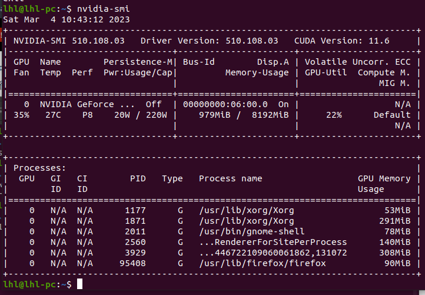
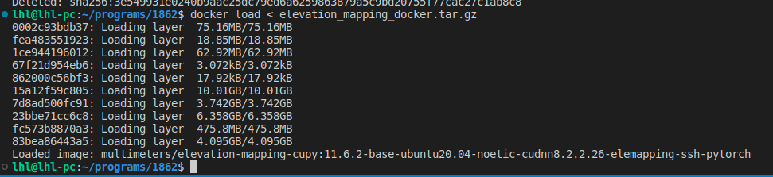
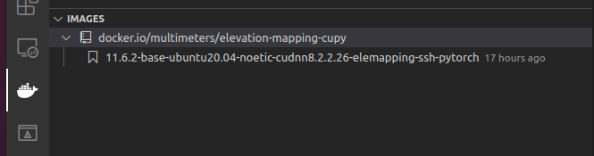
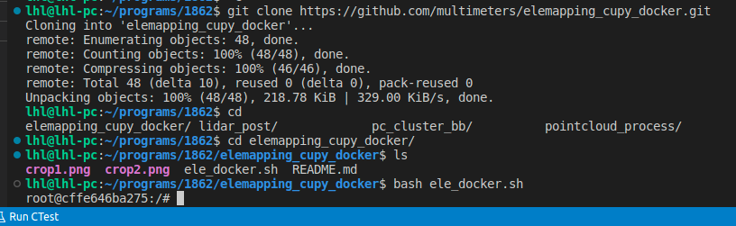
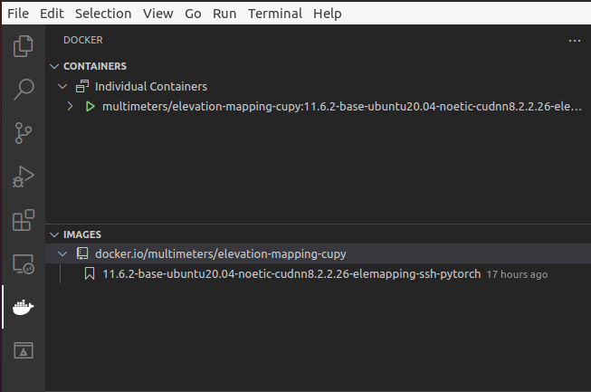
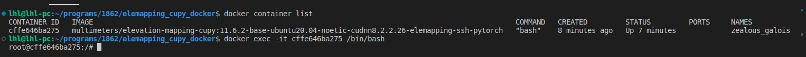
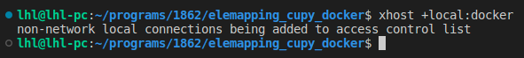
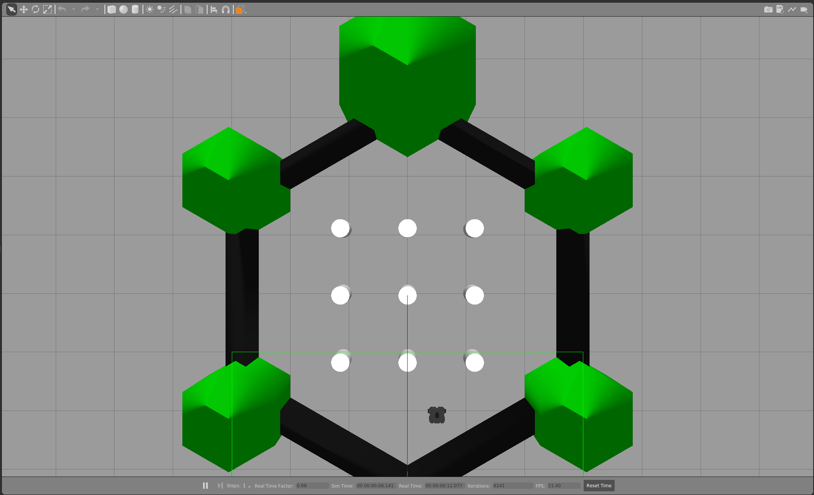
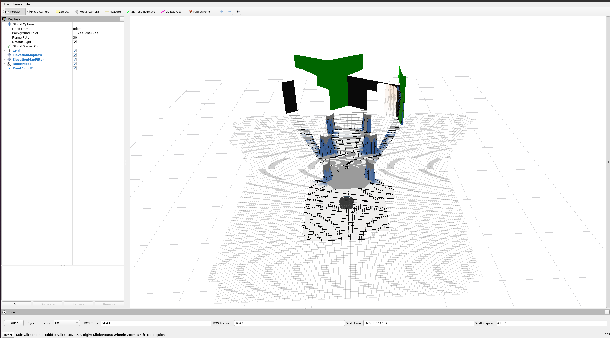
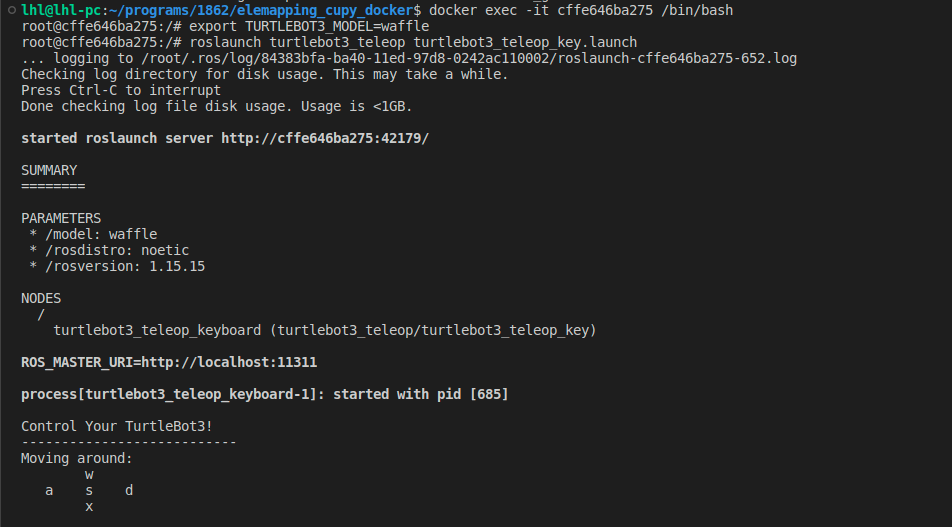

# elemapping_cupy_docker使用方法
## 1.在主机上安装nvidia 510版本的驱动
之所以安装nvidia 510版的驱动，是因为docker镜像里面使用的cuda是11.6版本的，与cuda11.6对应的驱动版本是510

## 2.在主机上配置 NVIDIA Container Toolkit
为了能让docker镜像使用GPU，主机上需要配置[NVIDIA Container Toolkit](https://github.com/NVIDIA/nvidia-docker) 
## 3.下载docker镜像
[elevation_mapping_docker.tar.gz](https://1drv.ms/u/s!Akfo1jwOehy0i4RAFHAqWv5E5C_i2Q?e=eK4QB8)
## 4.导入镜像 
```
docker load < elevation_mapping_docker.tar.gz
```

如果VS code中安装了docker插件，可以看到导入的docker镜像

## 5.使用镜像
```
git clone https://github.com/multimeters/elemapping_cupy_docker.git
cd elemapping_cupy_docker/
bash ele_docker.sh 
```

如果在VS code中安装了docker插件，可以看到启动了container


上面的指令可以开一个bash，如果要开第二个以及以上的bash的话需要输入指令：
  #### 1.先查看主机运行的docker container的id
  ```
  docker container list
  ```
  #### 2.然后在一个新终端执行
  ```
  docker exec -it cffe646ba275 /bin/bash
  ```

## 6.测试elevation_mapping_cupy程序
按照第5步操作进入container里面，输入下面的指令，会出现rviz和gazebo（为了能将container里面的GUI显示到主机上，注意主机上需要运行命令```xhost +local:docker```）


```
cd elevation_mapping_ws
source devel/setup.bash
export TURTLEBOT3_MODEL=waffle
roslaunch elevation_mapping_cupy turtlesim_example.launch
```


如果要使用键盘控制TURTLEBOT按照第5步操作开第二个终端，输入下面的指令：
```
export TURTLEBOT3_MODEL=waffle
roslaunch turtlebot3_teleop turtlebot3_teleop_key.launch
```

